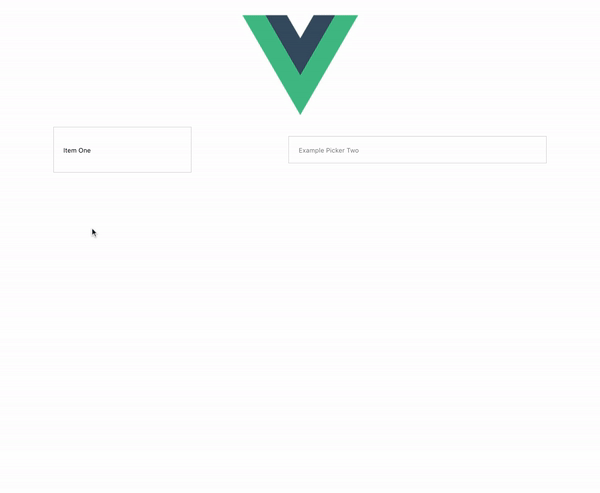

# vue-input-dropdown

[ ](https://www.npmjs.com/package/vue-input-dropdown)
[](https://vuejs.org/)

A simple to use, highly customizable input dropdown component for Vue

## Table of contents

- [Installation](#installation)
- [Usage](#usage)
- [Example](#example)

# Installation

```
npm install --save vue-input-dropdown
```

## Default import

Install all the components (theres just one for now):

```javascript
import Vue from 'vue'
import VueInputDropdown from 'vue-input-dropdown'

Vue.use(VueInputDropdown)

```

** A css file is included when importing the package. You may have to setup your bundler to embed the css in your page.**

## Distribution import

Install all the components:

```javascript
import 'vue-input-dropdown/dist/vue-input-dropdown.css'
import VueInputDropdown from 'vue-input-dropdown/dist/vue-input-dropdown.common'

Vue.use(VueInputDropdown)
```


**⚠️ You may have to setup your bundler to embed the css file in your page.**

## Browser

```html
<link rel="stylesheet" href="vue-input-dropdown/dist/vue-input-dropdown.css"/>

<script src="vue.js"></script>
<script src="vue-input-dropdown/dist/vue-input-dropdown.browser.js"></script>
```

The plugin should be auto-installed. If not, you can install it manually with the instructions below.

Install all the components:

```javascript
Vue.use(VueInputDropdown)
```

## Source import

Install all the components:

```javascript
import Vue from 'vue'
import VueInputDropdown from 'vue-input-dropdown/src'

Vue.use(VueInputDropdown)
```

Use specific components:

```javascript
import Vue from 'vue'
import { VueInputDropdown } from 'vue-input-dropdown/src'

Vue.component('vue-input-dropdown', VueInputDropdown)
```

**⚠️ You need to configure your bundler to compile `.vue` files.** More info [in the official documentation](https://vuejs.org/v2/guide/single-file-components.html).

# Usage

### props

| Prop          | Default/Required | Example                   | Type/Description                           |
| ------------- |:----------------:| -------------------------:| ------------------------------------------:|
| items         | None/REQUIRED    | :items="['LA', 'NY']"     | Array of strings - items in dropdown       |
| picked        | None/REQUIRED    | :picked="itemPicked"      | Callback function when item selected       |
| selected      | ""               | :selected="myCity"        | Currently selected state item              |
| options       | See Below        | :options="{}" see below   | Object containing full options             |

### options prop

This component was build to be customized. Almost fully. Pass option object to :option prop. 

| Option              | Default / Required  | Description                                                   |
| ------------------- |:-------------------:| -------------------------------------------------------------:|
| height              | REQUIRED            | The height of the input container. Needed for offset          |
| width               | REQUIRED            | The width of the input container. Needed for offset           |
| maxHeight           | auto                | The max height of the dropdown. Auto uses scroll on overflow  |
| outerContainerClass | .dropdown-container | Class to be used for the outermost container                  |
| inputClass          | .input-box          | Class to be used for the input element                        |
| dropdownClass       | .dropdown-inner     | Class to be used for the dropdown container                   |
| itemContainerClass  | .item               | Class to be used for the item wrappers inside the dropdown    |
| activeItemClass     | .active             | Class to be used for the currently selected Item              |
| nonActiveItemClass  | .non-active         | Class to be used for non-active items                         |
| transitionName      | slide-fade          | Name of the trasition to be used                              |
| outerContainerStyle | ""                  | Inline styling for outermost container                        |
| inputStyle          | ""                  | Inline styling for input box                                  |
| dropdownStyle       | ""                  | Inline styling for dropdown container                         |
| itemContainerStyle  | ""                  | Inline styling for item wrappers inside dropdown              |
| activeItemStyle     | ""                  | Inline styling for the currently selected item                |
| nonActiveItemStyle  | ""                  | Inline styling for non-active items                           |

> Not Complete, WIP

# Example

[Link to the example](https://github.com/cgberlin/vue-input-dropdown/blob/master/examples/src/App.vue)

---

# Plugin Development (feel free to create pull requests and I'll look over them)

> TODO: 
    - CREATE PROPER DEV ENVIRONMENT TO TEST USAGE AND IMPORTS
    - EDIT ESLINT OR JUST REMOVE 

## Installation

The first time you create or clone your plugin, you need to install the default dependencies:

```
npm install
```

## Watch and compile

This will run webpack in watching mode and output the compiled files in the `dist` folder.

```
npm run dev
```


## License

[MIT](http://opensource.org/licenses/MIT)
